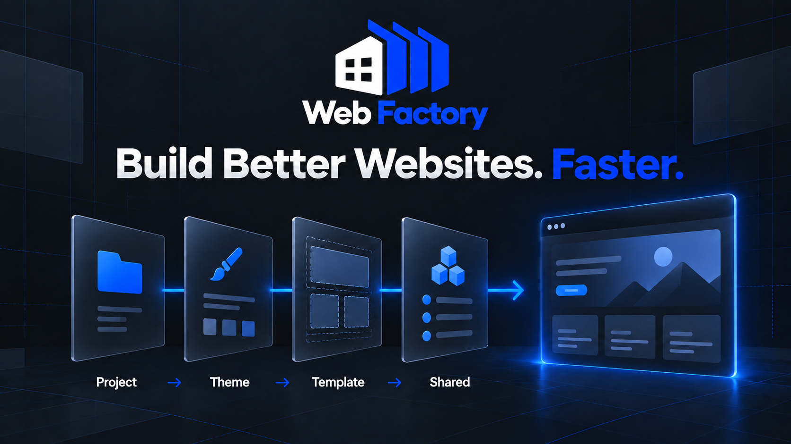

<p align="center">
  
</p>

<p align="center">
  <strong>Build Better Websites. Faster.</strong>
</p>

<p align="center">
  
</p>

# Web-Factory

An AI-ready Astro website factory for rapidly creating modern, production-ready websites using reusable themes, components, project overrides, and CLI automation.

## Attribution

Web Factory is an open-source Astro-based website factory designed for
rapidly building modern websites using reusable themes, components,
sections, project-level overrides, and CLI automation.

If you use Web Factory as the foundation of your project, please retain
the original copyright and license notices and include an acknowledgment
of Web Factory in your project documentation.

Original project:
https://github.com/henryliu8/Web-Factory.git

## Development workflow

Install the workspace dependencies:

```sh
pnpm install --frozen-lockfile
```

List the available building blocks and create a project:

```sh
pnpm wf list templates
pnpm wf list themes
pnpm wf create my-site --template stardrive --theme default --pages home,about,services,projects,contact
```

Run, check, or build a generated project by its directory name under `apps/`:

```sh
pnpm wf dev demo-site
pnpm wf check demo-site
pnpm wf build demo-site
```

Run the persistent cross-package integration gate:

```sh
pnpm test:integration
```

## Templates

- `stardrive` — the original flexible, content-first Web Factory structure.
- `astrowind` — an Astro v7 and Tailwind CSS v4 marketing/blog template adapted from [AstroWind](https://github.com/arthelokyo/astrowind). Its 37 reusable widgets live in the template section registry, while site content, navigation, configuration, and public assets remain project-owned in the scaffold.

Create an AstroWind-based project with:

```sh
pnpm wf create my-site --template astrowind --theme default --pages home,about,services,contact
```
